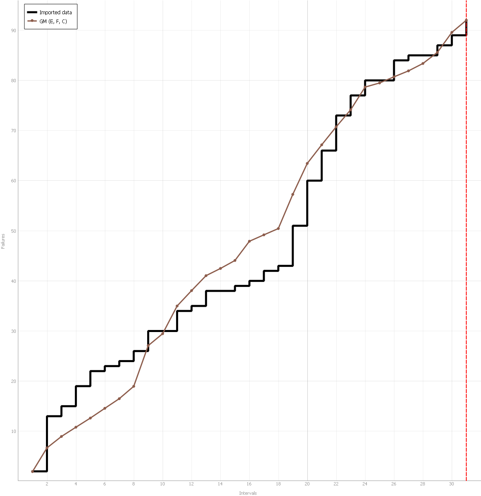
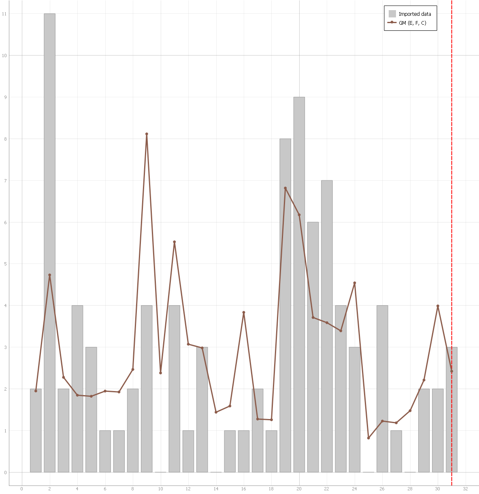
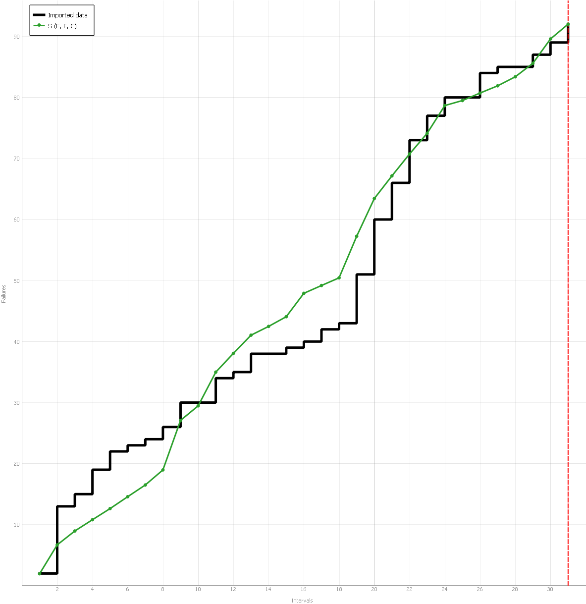
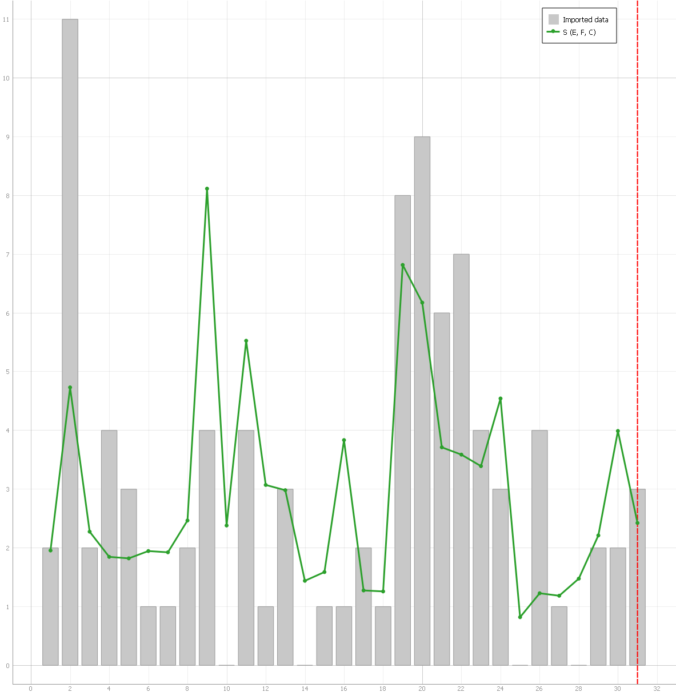
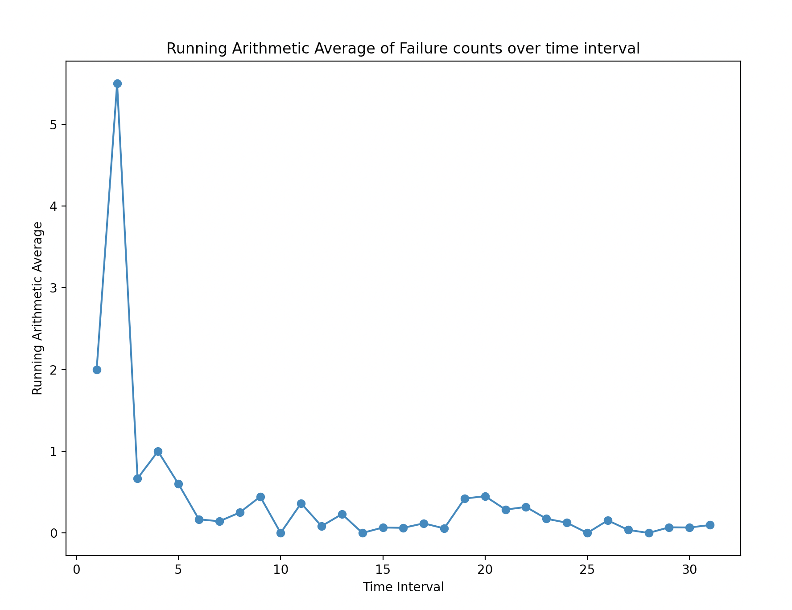
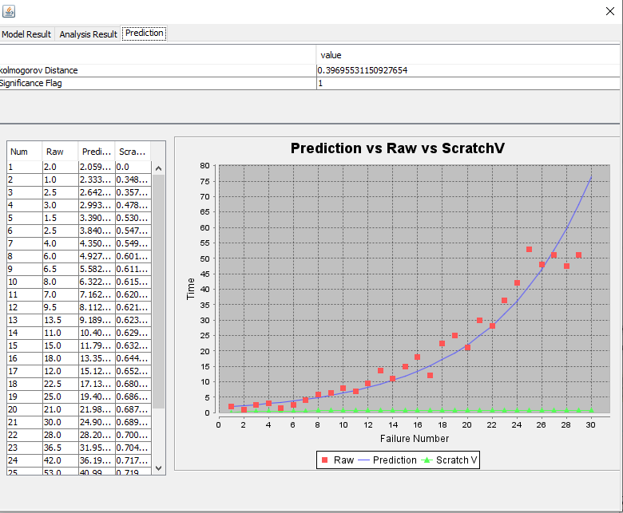
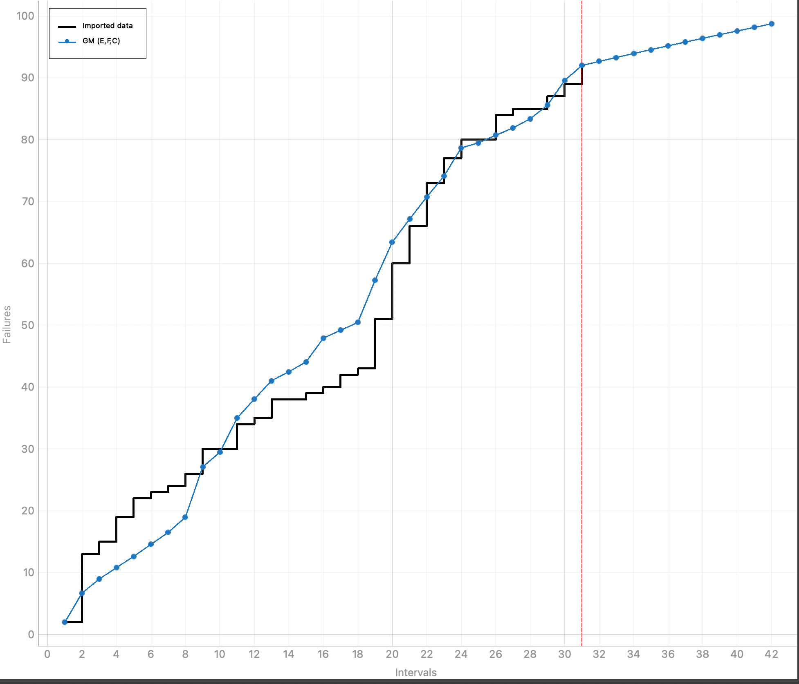
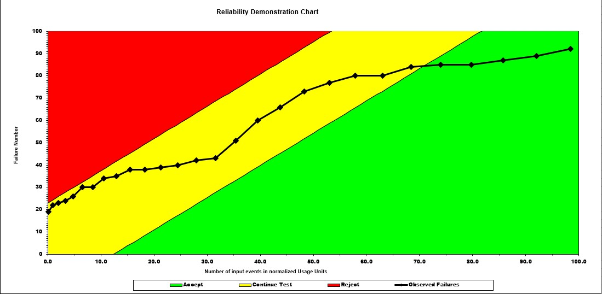
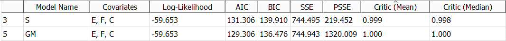

**SENG 438- Software Testing, Reliability, and Quality**
**Lab. Report \#5 – Software Reliability Assessment**

| Group \#: | 27         |
| --------- | ---------- |
| Michele   | Esercitato |
| Dylan     | Mah        |
| Faisal    | Hossain    |
| Cheyenne  | Goh        |

 

**Table of Contents**
1. [Introduction](#Introduction)
2. [Assessment Using Reliability Growth Testing](#Assessment-Using-Reliability-Growth-Testing)
3. [Assessment Using Reliability Demonstration Chart](#Assessment-Using-Reliability-Demonstration-Chart)
4. [Comparison of Results](#Comparison-of-Results)
5. [Discussion on Similarity and Differences of the Two Techniques](#Discussion-on-Similarity-and-Differences-of-the-Two-Techniques)
6. [How the team work/effort was divided and managed](#How-the-team-work/effort-was-divided-and-managed)
7. [Difficulties encountered, challenges overcome, and lessons learned](#Difficulties-encountered-challenges-overcome-and-lessons-learned)
8. [Comments/feedback on the lab itself](#Comments/feedback-on-the-lab-itself)

# Introduction
This lab was used to teach students about the analysis of integration test data, and the tools used for reliability assessment. We familiarized ourselves with C-SFRAT and reliability demonstration charts (RDC) to carry out reliability growth testing and reliability assessment respectively. We then explored and applied the concepts from the lectures (of SENG 438) to interpret the given failure data with the given tools.

# Assessment Using Reliability Growth Testing
The chosen plot models are Geometric and S-Distribution, and they use all three E, F and C covariates. They were chosen among all the other models offered by the C-SFRAT program, by visually assessing their accuracy; comparing the models, selecting those who most closly resempbled the shape of the input data; and by numerically comapring the model data which will be discussed in the [Comparison of Results](#Comparison-of-Results) section. Based on the Running Arithmetic average test on Figure 5, the range of useful data for analysis will be from time interval 20 to time interval 31.

Based on analyzing various inputs and models from Reliablity Growth Testing and the prediciting tools from C-SFRAT, as shown in Figure 7, the targeted failure rate will be approximately 2.5 failures per time interval. 

Figure 1: Geometric Model

Figure 2: Geometric Model - Intensity

Figure 3: S-Distribution Model

Figure 4: S-Distribution Model - Intensity

Figure 5: Arithmetic Average of failure counts over time interval

Figure 6: Time between failures - Geometric model

Figure 7: Geometric Model - Prediction

# Assessment Using Reliability Demonstration Chart
The MTTF was chosen by first deciding the maximum amount of failures that the system should encounter. The value of 3 was found to be reasonable because this would allow for some small faults in the system that would not massively impact the program. Also, it was a small enough number for the given data set since the failures at a given time would average to be over 3. Thus, the cumulative failure counter would become much larger over time. Below are the RDCs for the different MTTF values.

 

Figure 8: RDC with MTTF of 5

Figure 9: RDC for 2 * MTTF

Figure 10: RDC for 1/2 * MTTF

# Comparison of Results

Figure 11: Geometric vs S-Distribution 

# Discussion on Similarity and Differences of the Two Techniques
### Similarities
Both of the techniques can accept time-domain data (i.e., time-between-failures data) or interval-domain data (i.e. failure count data) as types of input failure data, depending on the tool being used. They both use target failure rate (or MTTF) in their testing.

### Differences
Reliability growth testing is based on inter failure times and/or failure count. In reliability growth testing, the accuracy of estimation of the failure intensity &#955; is improved for programs with an greater number of developed source lines.

On the other hand, RDC is based on inter failure times only. RDC should be used when there are only a few failures, the times of the failures are known, and reliability trend of the system is desired.

# Advantages and Disadvantages
### Reliability Growth Testing
The advantages of reliability growth testing include the ability to use several different models, assess their goodness of fit, and make predictions based on the plots. The disadvantage is that the accuracy of failure intensity estimation is reduced for smaller sample sizes.

### RDC Testing
The advantages of RDC analysis are its versitility in the data it can display plus it being a time and cost-efficient way of checking reliability. The disadvantage of RDC is it cannot quantify reliability, but can only show if the system should be accepted, rejected or continue to be developed.

# How the team work/effort was divided and managed
Our groups split into 2 teams that each tackled one part of the lab. Faisal and Michele handled part 1, while Dylan and Cheyenne handled part 2. The work from both parts were reviewed by every member to ensure consistency and accuracy of results.
#

# Difficulties encountered, challenges overcome, and lessons learned
### Difficulties
- Theory behind the tools

### Challenges
- Understanding how to use the different tools (RDC Excel chart, C-SFRAT)
- Choosing which tools that gave the most accurate measurements and models

### Lessons
- How to determine the reliability of a system using different tools
- Different tools/techniques to assess reliability and test reliability growth

# Comments/feedback on the lab itself
Intersting lab for learning about reliability tools and techniques.
